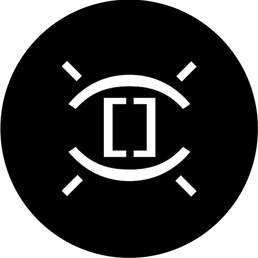

# markdown-link-expander
<!-- ALL-CONTRIBUTORS-BADGE:START - Do not remove or modify this section -->

<!-- ALL-CONTRIBUTORS-BADGE:END -->

> Logo by [Anna Verbovaya](https://www.instagram.com/anve.anve/)

Easily create pretty link lists from your URLs.

> Built a <a href="https://twitter.com/code?ref_src=twsrc%5Etfw">@code</a> extension that makes it easier to build link lists.
> Put in your URL, run `Expand` command, boom 💥
> You got a pretty markdown link.
> <a href="https://twitter.com/hashtag/vscode?src=hash&amp;ref_src=twsrc%5Etfw">#vscode</a>
>  
> 
>  
> &mdash; Simon Knott (@skn0tt) <a href="https://twitter.com/skn0tt/status/1280128212559958016?ref_src=twsrc%5Etfw">July 6, 2020</a>

> Check out [PasteURL](https://github.com/kukushi/PasteURL) too, it solves the same problem in a different way! :D

## Getting Started

1. Install the extension
2. Paste a URL and highlight it
3. `CMD+ALT+P`; "Expand URL to Markdown"
4. Profit

## TODO

- [ ] Add Citation Feature

## Contributors ✨

Thanks goes to these wonderful people ([emoji key](https://allcontributors.org/docs/en/emoji-key)):

<!-- ALL-CONTRIBUTORS-LIST:START - Do not remove or modify this section -->
<!-- prettier-ignore-start -->
<!-- markdownlint-disable -->
<table>
  <tr>
    <td align="center"><a href="http://stephen.parish.co"> <b>Stephen Parish</b></a> <a href="https://github.com/Skn0tt/markdown-link-expander/commits?author=stephenparish" title="Code">💻</a></td>
    <td align="center"><a href="https://www.instagram.com/anve.anve/"> <b>Anna Verbovaya</b></a> <a href="#design-anve.anve" title="Design">🎨</a></td>
  </tr>
</table>

<!-- markdownlint-restore -->
<!-- prettier-ignore-end -->

<!-- ALL-CONTRIBUTORS-LIST:END -->

This project follows the [all-contributors](https://github.com/all-contributors/all-contributors) specification. Contributions of any kind welcome!
