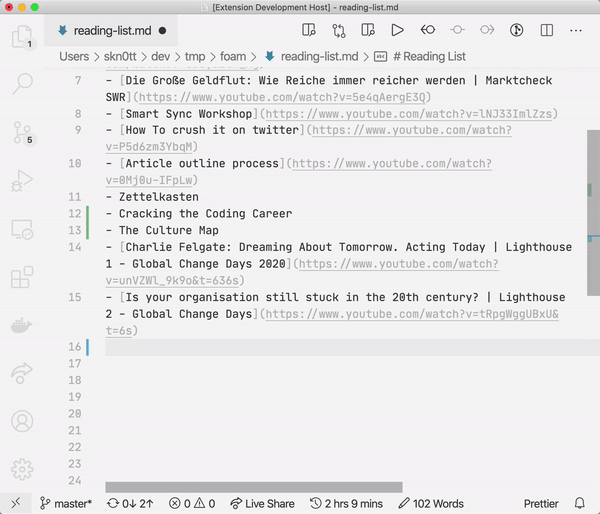

# markdown-link-expander

Easily create pretty link lists from your URLs.

> Built a <a href="https://twitter.com/code?ref_src=twsrc%5Etfw">@code</a> extension that makes it easier to build link lists.
> Put in your URL, run `Expand` command, boom 💥
> You got a pretty markdown link.
> <a href="https://twitter.com/hashtag/vscode?src=hash&amp;ref_src=twsrc%5Etfw">#vscode</a>
>  
> 
>  
> &mdash; Simon Knott (@skn0tt) <a href="https://twitter.com/skn0tt/status/1280128212559958016?ref_src=twsrc%5Etfw">July 6, 2020</a>

## Getting Started

1. Install the extension
2. Paste a URL and highlight it
3. `CMD+ALT+P`; "Expand URL to Markdown"
4. Profit

## Release Notes

### 0.1.0

Initial release of URL expanding.
